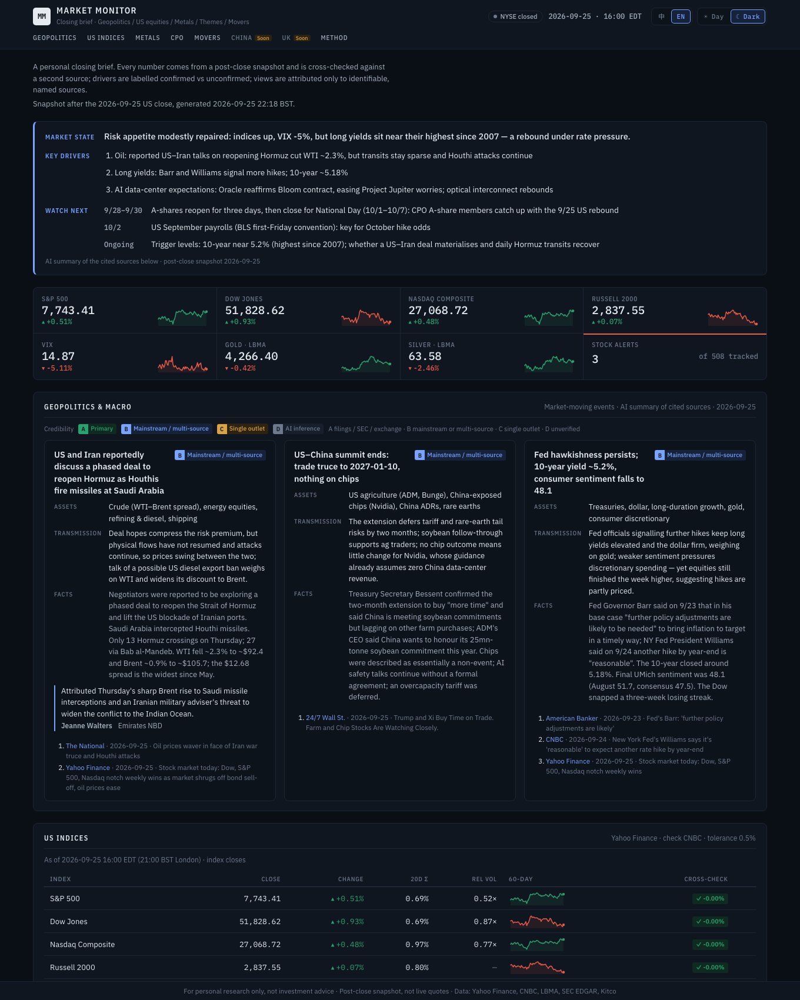
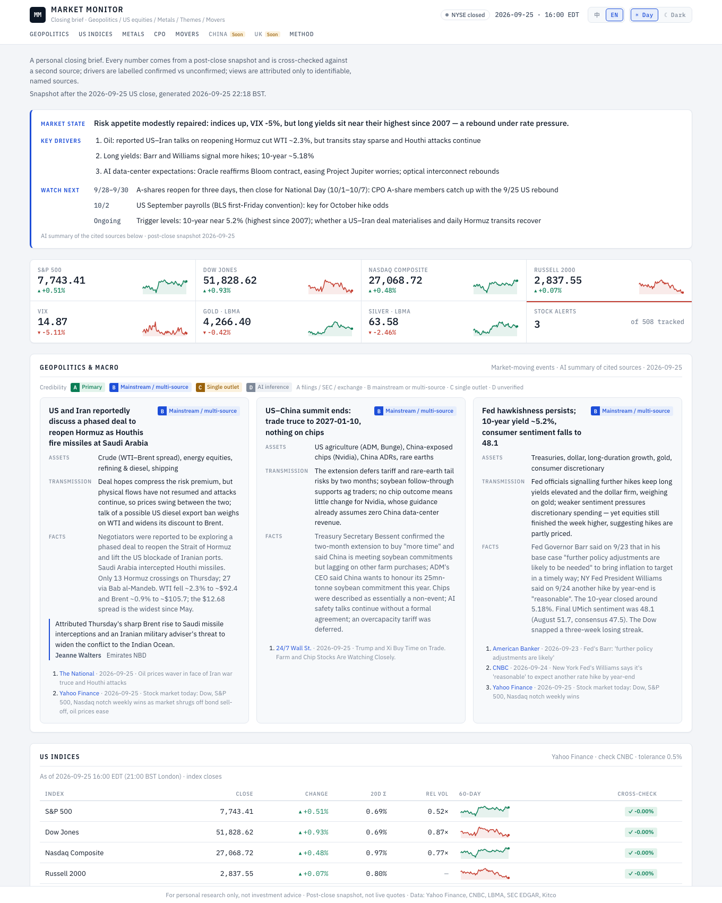
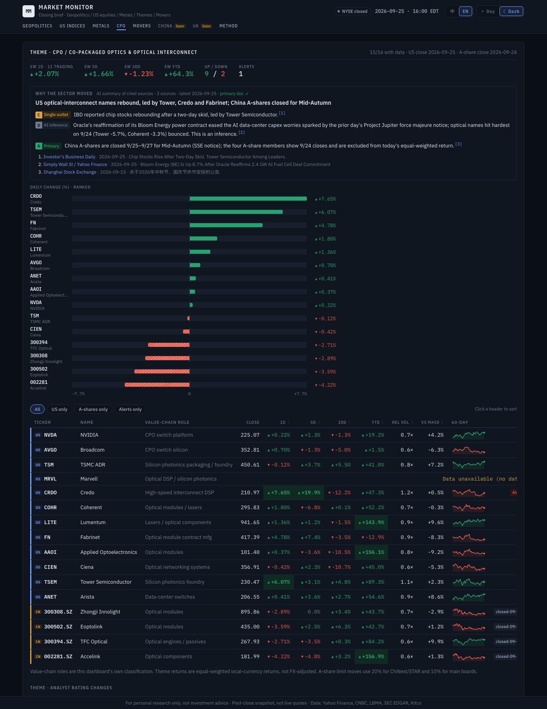

# Market Monitor

**A daily closing brief for US equities, precious metals, the CPO / optical-interconnect theme and single-stock movers — built around data discipline: every number is fetched live, cross-checked against a second source, and every opinion is attributed to a named source.**

**Live page:** https://claude.ai/artifact/MNtBzS83NLwwyNcxRe9mhM · bilingual (中文 / EN) · Day / Dark



## What it does

| Module | Content |
|---|---|
| **Today's conclusion** | Market state, three key drivers, and dated items to watch next |
| **Geopolitics & macro** | 3–5 market-moving events a day, each as *event → affected assets → transmission logic → facts → source* |
| **US indices** | S&P 500, Dow, Nasdaq, Russell 2000, VIX — close, change, 20-day σ, relative volume, 60-day sparkline, CNBC cross-check |
| **Precious metals** | LBMA fixes vs COMEX/NYMEX front-month futures for gold, silver, platinum, palladium |
| **Theme tracker: CPO** | 16 names across the co-packaged-optics value chain (NVIDIA, Broadcom, TSMC, Coherent, Lumentum… plus 4 China A-share optical module makers): equal-weighted 1D/5D/20D/YTD, ranked diverging bar chart, value-chain role |
| **Movers & alerts** | S&P 500 + Nasdaq-100 + theme members screened for ±7% or ≥2.5σ moves; each flagged stock gets *why it moved* (tagged Confirmed / Analyst / Media report / AI inference, with numbered sources), SEC 8-K filings, analyst rating & target changes, valuation / liquidity / crowding metrics and key technical levels |

## Design principles

- **No number without a source.** Every figure is stored in a timestamped snapshot with its source. If today's bar is missing the page says *N/A* — stale data is never substituted.
- **Two-source verification.** Index, futures and mover prices are checked against CNBC; gaps above 0.5% are flagged red. LBMA fixes dated differently from the session are marked *stale* and excluded from alert triggers.
- **Credibility grades on every claim.** **A** company filing / SEC / exchange · **B** mainstream outlet or multiple sources agreeing · **C** single outlet · **D** AI inference, unverified. Each AI-written reason also shows its evidence count, latest source date and whether a primary document exists. Analyst views must name the person or firm — never “analysts say”.
- **Snapshot, not a ticker.** Everything is a post-close snapshot, labelled as such; the page never implies live quotes.
- **Built for scanning.** A three-line *today's conclusion* (market state · key drivers · what to watch next) sits above the tape; movers are summary rows with expandable detail, sortable and filterable (filings only, company catalyst only, theme members, hide no-catalyst).
- **Calendar- and DST-correct scheduling.** `exchange_calendars` gives each session's real close (including early closes); `zoneinfo` handles the UK/US daylight-saving mismatch; runs are idempotent under `launchd`.

<p>


</p>

## Stack

Python 3.12 · yfinance · exchange_calendars · pandas · Jinja2 · BeautifulSoup · SEC EDGAR API · LBMA JSON · static HTML/CSS (no JS framework) · macOS launchd

```bash
uv venv -p 3.12 .venv && uv pip install -p .venv/bin/python -r requirements.txt
.venv/bin/python -m src.run --market us     # fetch the latest closed session and render site/
```

*For personal research only — not investment advice.*

---

## 中文说明

### Market Monitor · 个人金融看台

每个交易日在各市场收盘后自动抓取数据，生成静态 HTML 看台（`site/index.html`），并按日期存档快照。

**当前阶段**：美股主要指数 + 贵金属 + 主题追踪（CPO）+ 异动预警。中国（A股/港股）、英国、地缘、交易 Case 为下一阶段。

---

## 1. 安装

需要 [uv](https://docs.astral.sh/uv/)（或任意 Python ≥ 3.10）。

```bash
cd ~/fin-dashboard
uv venv -p 3.12 .venv
uv pip install -p .venv/bin/python -r requirements.txt
```

## 2. API key / 配置

MVP 不需要任何付费或需要注册的 key。

| 配置项 | 位置 | 说明 |
|---|---|---|
| `sec_user_agent` | `config/settings.local.yaml`（复制 `settings.local.example.yaml`，不提交到 git） | 填写联系邮箱。SEC EDGAR 要求 User-Agent 含联系方式，如 `"fin-dashboard your.name@example.com"`。留空则异动卡片不检索 8-K 等公告（「已证实驱动」只剩财报日）。免费、无需注册。 |

后续阶段可能用到：FRED API key（免费注册，宏观数据）、tushare token（A股第二源，可选）。

## 3. 手动触发

```bash
.venv/bin/python -m src.run --market us                     # 最近一个已收盘交易日
.venv/bin/python -m src.run --market us --date 2026-09-23   # 指定交易日（回补）
.venv/bin/python -m src.run --render                        # 仅用已有快照重新生成页面
.venv/bin/python -m src.run --auto                          # 调度模式：到点且未完成才执行
```

打开 `site/index.html` 查看。历史快照在页面右上角下拉框，或 `site/archive/<日期>.html`。

退出码：0 成功；1 非交易日（加 `--force` 可强制）；2 核心数据缺失（页面显示「数据暂缺」）。

## 4. 自动调度（launchd）

```bash
./scripts/install_launchd.sh            # 安装
./scripts/install_launchd.sh uninstall  # 卸载
```

launchd 每 10 分钟调用一次 `run --auto`。程序用 `exchange_calendars` 取交易所当日**实际收盘时刻**（含提前收盘，如感恩节次日 13:00 ET），加 `delay_minutes` 后才执行：

| 市场 | 触发（伦敦时间，自动随夏令时变化） |
|---|---|
| 美股 | 10/25 前 21:20 BST · 10/25–11/1 **20:20 GMT** · 11/1 后 21:20 GMT |

- 电脑休眠时不会运行；唤醒后下一个 10 分钟周期会自动补跑（同一交易日只跑一次）。
- 核心数据（主要指数）未结算时，会在后续周期重试，最多 `max_auto_attempts` 次。
- 状态文件：`data/state.json`；日志：`logs/<日期>.log`。

## 5. 修改异动阈值

编辑 `config/alerts.yaml`，下次运行生效：

```yaml
stocks:
  pct_move: 7.0            # |单日涨跌幅| ≥ 7%
  sigma_multiple: 2.5      # 或 |涨跌幅| ≥ 2.5 × 20日σ
  sigma_window: 20
  sigma_min_abs_pct: 4.0   # σ 触发时还需 |涨跌幅| ≥ 4%（0 = 不设下限）
  detail_cards: 12         # 生成完整分析卡片的数量
indices:
  pct_move: 2.0
metals:
  gold: 2.0
  silver: 3.0
  platinum: 3.0
  palladium: 3.0
  trigger_source: either   # lbma / futures / either
universe:
  us: [sp500, nasdaq100]
```

> σ 规则单独使用会触发大量低波动股（如公用事业股 -2.3% 即达 3σ）。2026-09-23 实测：不设下限触发 66 只，设 4% 下限触发 27 只。

主题成员（如 CPO）在 `config/themes.yaml`，可增删成员或新增主题，美股成员自动并入异动监控池；专家观点的机构白名单在 `config/insights.yaml`；指数与贵金属品种在 `config/settings.yaml`；交易所日历未覆盖的临时休市日填 `config/holidays_override.yaml`。

## 6. 数据源与准确性规则

| 数据 | 主源 | 校验源 |
|---|---|---|
| 美股指数、个股日线 | Yahoo Finance（yfinance） | CNBC 行情接口 |
| 贵金属 | LBMA 定价（prices.lbma.org.uk） + COMEX/NYMEX 近月期货（Yahoo） | CNBC |
| 标的池 | S&P 500（Wikipedia）+ Nasdaq-100（Nasdaq 官方 API），缓存 7 天 | — |
| 公告 | SEC EDGAR | — |
| 新闻 / 专家观点 | Yahoo Finance 新闻流原文、Kitco News | — |

- 每个数字都存于 `data/snapshots/<日期>/<市场>.json`，附来源和时间戳；页面只从快照渲染。
- 当日 K 线不存在（未结算/停牌/抓取失败）时显示「数据暂缺」并写入错误日志，**不回退到旧数据**。
- 指数和异动个股都与第二源比对，差异超过 0.5% 显示红色「✗」；第二源报价不是同一交易日时显示「未校验」（回补历史日期时必然如此）。
- LBMA 定价日期 ≠ 交易日时，页面标注「非当日」，且不参与异动触发。
- 21:20 伦敦时点的期货价格是 Yahoo 日线最新价，不是 COMEX 官方结算价（13:30 ET）。

### 驱动因素

- **已证实**：SEC 公告（8-K 条目已译为中文）、Yahoo 财报日历中 T-3 到 T 日的财报。
- **未证实**：近 48 小时新闻标题，逐条标「未证实」。

### Expert Insight（纯规则，无 LLM）

只收录**同一句子里**同时出现「人名 + 白名单机构 + 归属动词/引号」，并且提到标的的句子，例如：

- `Ryan McKay, Senior Commodity Strategist at TD Securities, said …`
- `Morgan Stanley analyst Matthew Cost … rating Airbnb Equal-Weight …`

句子**逐字引用**，附发布方、日期、链接。「Analysts at X said…」这类没有人名的泛称不收录。付费墙站点（WSJ、Barron's、Bloomberg、FT）会跳过。
找不到时显示「暂无可核实的专家观点（已扫描 N 篇）」。预期覆盖率：个股约 1–3 成，贵金属（Kitco）较高。

### 分析师观点（兜底顺序）

1. 具名原话（上面的规则提取）；
2. 近 30 日卖方评级/目标价变动（机构名 + 日期 + 新旧评级 + 新旧目标价，Yahoo Finance）；
3. 一致评级分布与目标价区间。

三者皆无才显示「暂无可核实的分析师观点」。不生成任何无来源的概括性观点。

### 发布公开网页

`python -m src.run --render` 同时生成 `site/public.html`（公开版：不含新闻原句、不含存档链接）。公开网页需在 Claude 对话中重新发布才会更新。

### 风险分析

MVP 中的风险分析是**数据指标，不是文字判断**：

- 估值：P/E、P/S、P/B
- 流动性：20 日均成交额、量比
- 拥挤程度：空头占流通股比例、回补天数
- 波动：Beta、20 日 σ
- 技术面：MA20/50/200 偏离、52 周高低、前日高低、RSI14、跳空、连续涨跌天数

监管风险没有可靠的免费自动化数据源，页面上会注明。

## 7. 目录

```
config/      settings / alerts / insights / holidays_override
src/         run.py（入口）· build_us.py · alerts.py · insights.py · calendars.py · render.py
src/fetchers yahoo · cnbc · lbma · universe · news(Yahoo/Kitco/SEC)
templates/   dashboard.html.j2
data/        snapshots/<日期>/<市场>.json · cache/ · state.json
site/        index.html · archive/<日期>.html
logs/
```

---

仅供个人研究参考，不构成投资建议。
